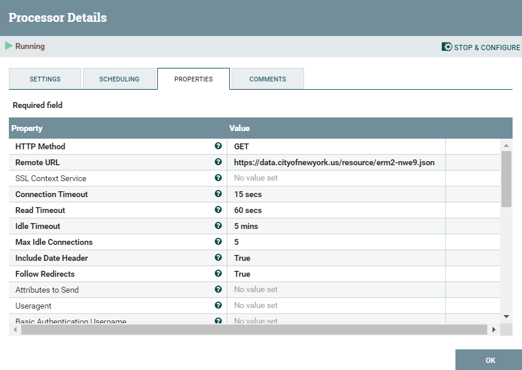
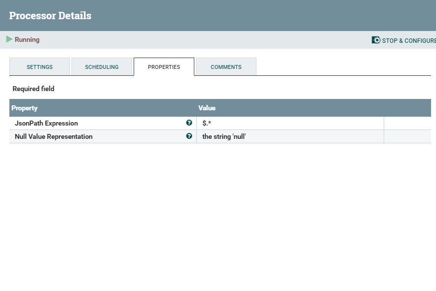
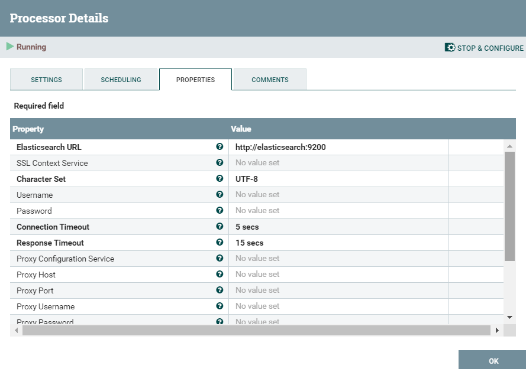
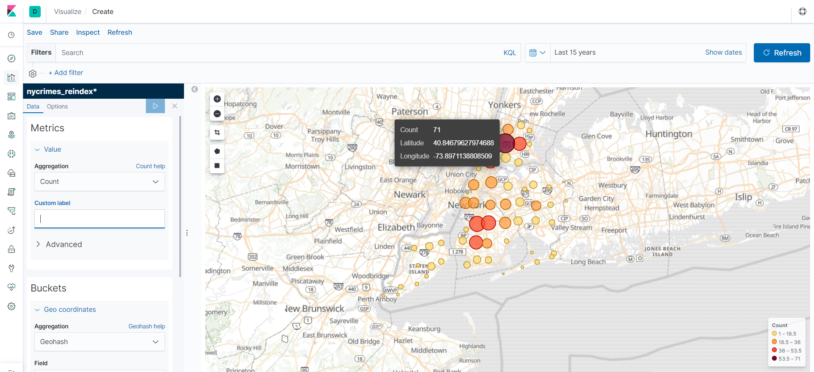
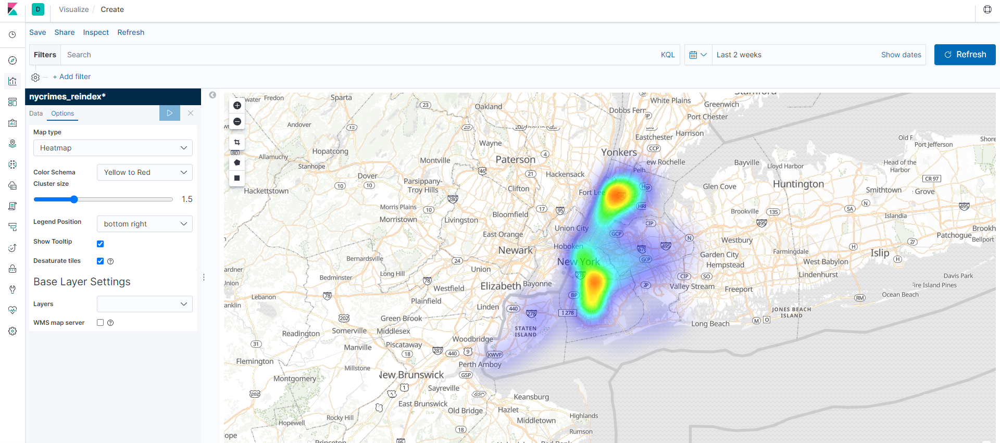

# EXERCISE NiFi + ELK

#### Exercise description: 

Represent a solution that shows in a map the crimes location of the following API :

https://data.cityofnewyork.us/Social-Services/311-Service-Requests-from-2010-to-Present/erm2-nwe9

Using Apache NiFi & ELK


#### HOW TO:

##### 1st

Run the docker-compose file contained in folder 'dockertest', which contains the services we'll need:

```sh
    docker-compose up -d
```

And check everything is 'running' fine


##### 2nd

NiFi WorkFlow


| Processor | Usage |
| --- | --- |
| InvokeHTTP | Connect to the API and gets the dataset |
| SplitJSON | Splits the returned JSON into JSON docs |
| PutElasticsearchHTTP | Uploads the resultings docs into Elasticsearch |

##### Processors config:

InvokeHTTP



SplitJson



PutElasticsearchHTTP




#### 3rd

Check the flowfile from NiFi to Elastic it's OK and it's uploading docs on 'nycrimes' [Kibana (localhost:5601) -> Management -> Index Management]


After that, create a new index through [Reindex API](https://www.elastic.co/guide/en/elasticsearch/reference/current/docs-reindex.html) and create a new index pattern


#### 4th

Create a 'Coordinate Map' on 'Visualizations' and play around the different options!






